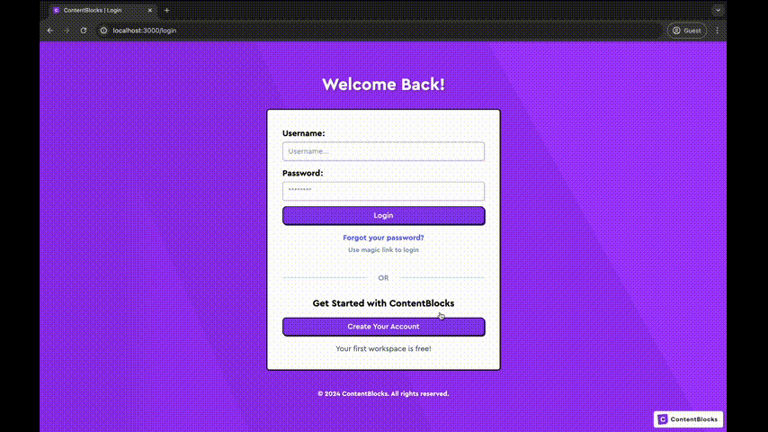

# ContentBlocks Take Home Assignment

## Description

Alternative authentication with Clerk for ContentBlocks (also keeping Magic Link Method).

## Demo

Below is a demonstration in action:



## Approach Taken

1. **Clerk Integration**:

   - Integrated Clerk for authentication to provide a seamless and secure login experience.
   - Utilized Clerk's sign-up, sign-in, and sign-out functionalities to manage user authentication.
   - Maintained existing Magic Link authentication for users who prefer that method, ensuring a flexible authentication system.

2. **State Management**:

   - Used Jotai for state management to handle form inputs and error messages.
   - Centralized state management improved the readability and maintainability of the code.

3. **Form Handling and Validation**:

   - Implemented input change handlers and validation functions to manage form states and validate user inputs.
   - Provided user-friendly error messages to guide users in correcting input errors.

4. **Navigation and User Feedback**:

   - Utilized `react-router-dom` for navigation, redirecting users upon successful login or sign-up.
   - Added user feedback through error messages and page titles to enhance the user experience.

5. **UI and Styling**:
   - Applied consistent styling using CSS modules to ensure a cohesive look and feel.
   - Used responsive design principles to ensure the application is accessible on various devices.

## Available Scripts

First run install:

### `npm install`

Then create .env file and put your own Clerk key in it with following format:

### `REACT_APP_CLERK_PUBLISHABLE_KEY=<YOUR-KEY>`

Here's a key you can use to test

### `REACT_APP_CLERK_PUBLISHABLE_KEY="pk_test_cnVsaW5nLWZsYW1pbmdvLTQ2LmNsZXJrLmFjY291bnRzLmRldiQ"`

In the project directory, you can run:

### `npm start`

Runs the app in the development mode.\
Open [http://localhost:3000](http://localhost:3000) to view it in your browser.

The page will reload when you make changes.\
You may also see any lint errors in the console.

### `npm test`

Launches the test runner in the interactive watch mode.\
See the section about [running tests](https://facebook.github.io/create-react-app/docs/running-tests) for more information.

### `npm run build`

Builds the app for production to the `build` folder.\
It correctly bundles React in production mode and optimizes the build for the best performance.

The build is minified and the filenames include the hashes.\
Your app is ready to be deployed!

See the section about [deployment](https://facebook.github.io/create-react-app/docs/deployment) for more information.

### `npm run eject`

**Note: this is a one-way operation. Once you `eject`, you can't go back!**

If you aren't satisfied with the build tool and configuration choices, you can `eject` at any time. This command will remove the single build dependency from your project.

Instead, it will copy all the configuration files and the transitive dependencies (webpack, Babel, ESLint, etc) right into your project so you have full control over them. All of the commands except `eject` will still work, but they will point to the copied scripts so you can tweak them. At this point you're on your own.

You don't have to ever use `eject`. The curated feature set is suitable for small and middle deployments, and you shouldn't feel obligated to use this feature. However we understand that this tool wouldn't be useful if you couldn't customize it when you are ready for it.

## Password Hashing Demonstration

To demonstrate password hashing, you can use a library like bcrypt.js. Here's an example of how you can hash a password using bcrypt.js:

```javascript
const bcrypt = require("bcryptjs");

const password = "myPassword123";
const saltRounds = 10;

bcrypt.hash(password, saltRounds, (err, hash) => {
  if (err) {
    console.error(err);
    return;
  }
  console.log("Hashed password:", hash);
});
```
